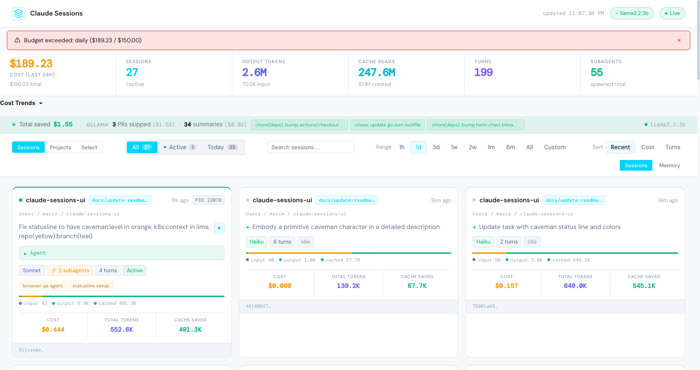

# Claude Sessions UI

[](https://github.com/morissette/claude-sessions-ui/actions/workflows/lint.yml)
[](https://github.com/morissette/claude-sessions-ui/actions/workflows/test.yml)



A real-time monitoring dashboard for Claude CLI sessions. Tracks token usage, costs, and activity across all your Claude conversations with live WebSocket updates and AI-powered session summarization.

> **[Full feature walkthrough with screenshots →](FEATURES.md)**

## Features

- **Live session monitoring** — WebSocket-based real-time updates every 2 seconds
- **Token & cost tracking** — Input, output, cache creation, and cache read tokens with cost estimates per model
- **Session filtering & sorting** — Filter by active/today/all; sort by activity, cost, or turns
- **Session detail overlay** — Paginated message viewer with tool blocks, thinking blocks, and transcript export
- **Full-text search** — Find sessions by content, queries, or metadata
- **Session analytics** — Turn timeline, cost curves, tool usage breakdown, and cost trend charts
- **Budget guardrails** — Real-time budget breach banner with configurable alerts
- **Batch operations** — Multi-select sessions, ZIP export, CSV cost reports, bulk summarization
- **AI session summaries** — Local Ollama (Llama 3.2) summarizes sessions on demand
- **Export as skill** — Create a Claude Code skill file from any session (global or local scope)
- **Savings analytics** — Tracks cost savings from PR-skip summaries and tool output truncation
- **Prometheus metrics** — Exports session/token/cost metrics at `/metrics`
- **Subagent tracking** — Identifies and labels subagent activity within sessions
- **Historical data** — SQLite-backed store for time ranges from 1h up to 6m; startup backfill on launch

## Tech Stack

| Layer | Technology |
|---|---|
| Frontend | React 18, Vite 5, DM Sans + DM Mono |
| Backend | Python 3.14, FastAPI, Uvicorn |
| Database | SQLite (derived cache — safe to delete and rebuild) |
| Real-time | WebSockets |
| Optional AI | Ollama (Llama 3.2) |
| Metrics | Prometheus |

## Prerequisites

- Python 3.14+ with [pipenv](https://pipenv.pypa.io/)
- Node.js 18+ with npm
- [Ollama](https://ollama.ai/) (optional — for session summarization)

## Setup

```bash
# Install Python dependencies
pipenv install

# Install frontend dependencies
cd frontend && npm install && cd ..
```

## Running

**Development** (hot reload on both frontend and backend):
```bash
./dev.sh
```
- Frontend: http://localhost:5173
- Backend API: http://localhost:8765

**Production** (builds frontend, serves everything from FastAPI):
```bash
./start.sh
```
- App: http://localhost:8765

## Docker

```bash
# Build the image
./docker.sh build

# Start at http://localhost:8765
./docker.sh up

# Stop
./docker.sh down

# Tail logs
./docker.sh logs
```

Docker mounts `~/.claude/` into the container so the dashboard reads your real session files. Point Ollama at the host by setting `OLLAMA_URL` in `docker-compose.yml`:

```yaml
environment:
  - OLLAMA_URL=http://host.docker.internal:11434
```

## API

| Endpoint | Description |
|---|---|
| `GET /api/sessions` | All sessions with stats for the given `time_range` |
| `GET /api/search` | Full-text search sessions by content or metadata |
| `GET /api/sessions/{id}/detail` | Paginated message thread for a session |
| `GET /api/sessions/{id}/transcript` | Full session as Markdown download |
| `GET /api/sessions/{id}/analytics` | Session analytics (turn timeline, cost curve, tool usage) |
| `POST /api/sessions/{id}/summarize` | Generate Ollama AI summary |
| `POST /api/sessions/{id}/export-skill` | Export session as a Claude Code skill file |
| `POST /api/batch/summarize` | Generate AI summaries for multiple sessions |
| `POST /api/batch/export` | Export multiple sessions as ZIP archive |
| `POST /api/batch/cost-report` | Generate CSV cost report for selected sessions |
| `GET /api/ollama` | Ollama availability and model status |
| `GET /metrics` | Prometheus metrics (10 gauges) |
| `WS /ws?time_range=1d` | WebSocket stream; updates every 2s (live) or 10s (historical) |

## Time ranges

| Range | Data source |
|---|---|
| `1h`, `1d` | Live JSONL parse (fast path) |
| `3d`, `1w`, `2w`, `1m`, `6m` | SQLite historical store |

The SQLite database (`~/.claude/claude-sessions-ui.db`) is a derived cache. Delete it and restart to rebuild from JSONL.

## Data Sources

| Path | Purpose |
|---|---|
| `~/.claude/projects/` | Session JSONL files (source of truth) |
| `~/.claude/claude-sessions-ui.db` | SQLite historical cache |
| `~/.claude/session_summaries/` | Ollama summary cache |
| `~/.claude/claude-sessions-ui.log` | Runtime logs |
