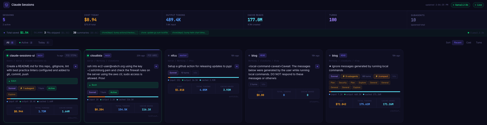

# Claude Sessions UI

[](https://github.com/morissette/claude-sessions-ui/actions/workflows/lint.yml)



A real-time monitoring dashboard for Claude CLI sessions. Tracks token usage, costs, and activity across all your Claude conversations with live WebSocket updates and AI-powered session summarization.

## Features

- **Live session monitoring** — WebSocket-based real-time updates every 2 seconds
- **Token & cost tracking** — Input, output, cache creation, and cache read tokens with cost estimates per model
- **Session filtering & sorting** — Filter by active/today/all; sort by activity, cost, or turns
- **AI session summaries** — Local Ollama (Llama 3.2) summarizes sessions on demand
- **Savings analytics** — Tracks cost savings from PR-skip summaries and tool output truncation
- **Prometheus metrics** — Exports session/token/cost metrics at `/metrics`
- **Subagent tracking** — Identifies and labels subagent activity within sessions

## Tech Stack

| Layer | Technology |
|---|---|
| Frontend | React 18, Vite 5 |
| Backend | Python 3.11, FastAPI, Uvicorn |
| Real-time | WebSockets |
| Optional AI | Ollama (Llama 3.2) |
| Metrics | Prometheus |

## Prerequisites

- Python 3.11+ with [pipenv](https://pipenv.pypa.io/)
- Node.js 18+ with npm
- [Ollama](https://ollama.ai/) (optional — for session summarization)

## Setup

```bash
# Install Python dependencies
pipenv install

# Install frontend dependencies
cd frontend && npm install && cd ..
```

## Running

**Development** (hot reload on both frontend and backend):
```bash
./dev.sh
```
- Frontend: http://localhost:5173
- Backend API: http://localhost:8765

**Production** (builds frontend, serves everything from FastAPI):
```bash
./start.sh
```
- App: http://localhost:8765

## API

| Endpoint | Description |
|---|---|
| `GET /api/sessions` | All sessions with stats |
| `GET /api/ollama` | Ollama availability check |
| `POST /api/sessions/{id}/summarize` | Generate AI summary for session |
| `GET /metrics` | Prometheus metrics |
| `WS /ws` | WebSocket stream (updates every 2s) |

## Data Sources

- Session files: `~/.claude/projects/`
- Session summaries cache: `~/.claude/session_summaries/`
- Application log: `~/.claude/claude-sessions-ui.log`
